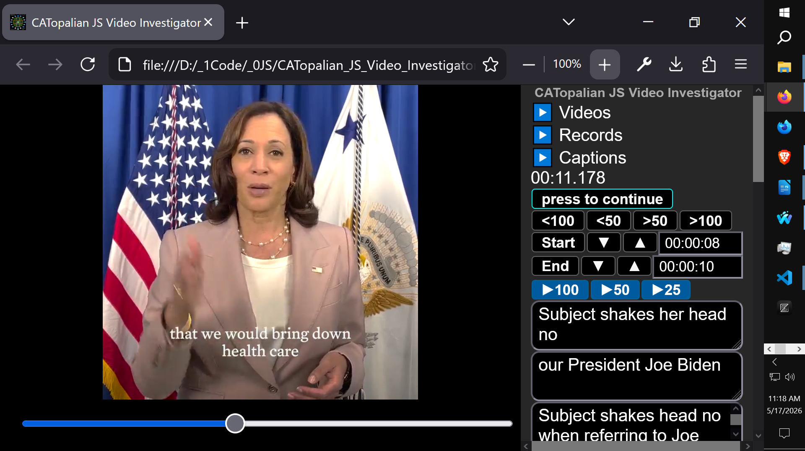
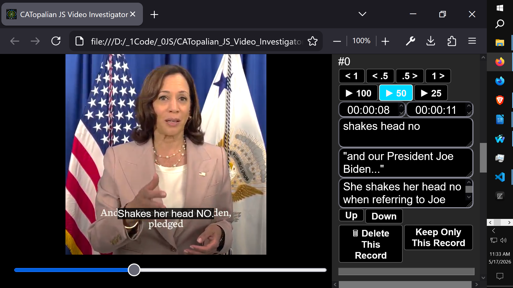
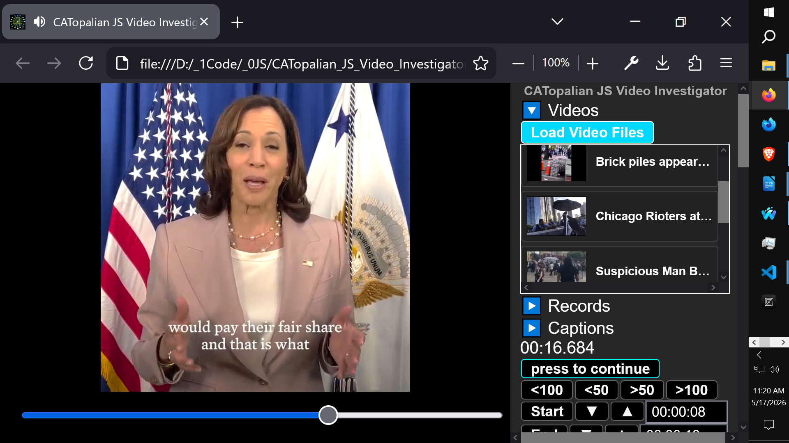
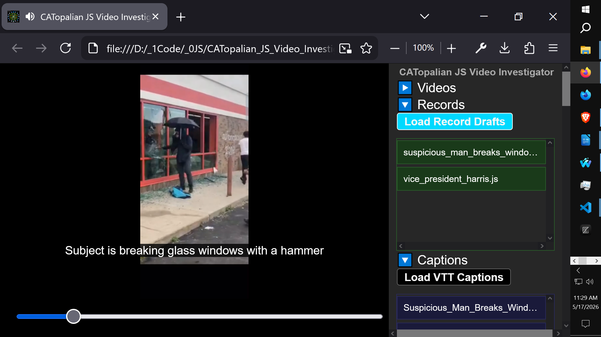
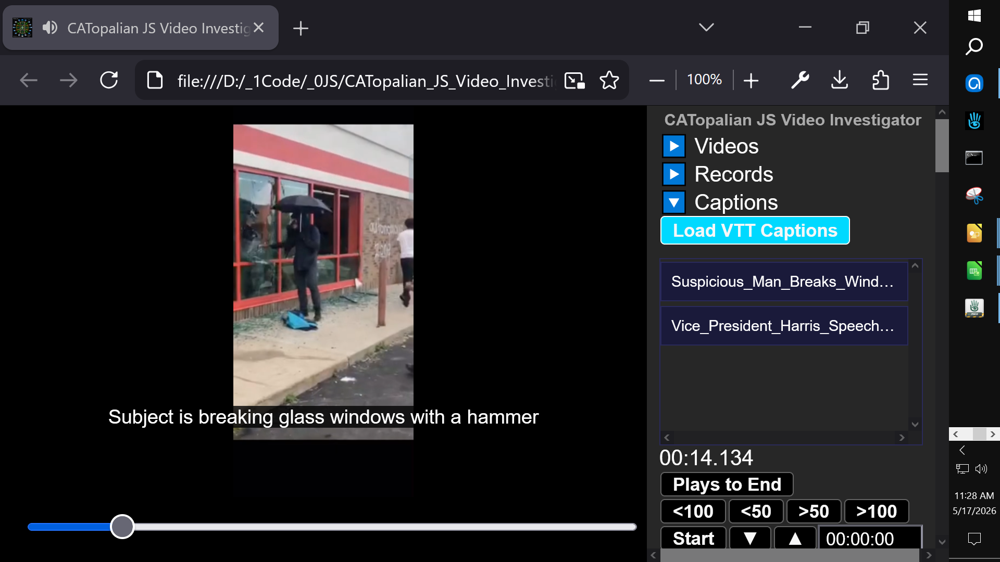
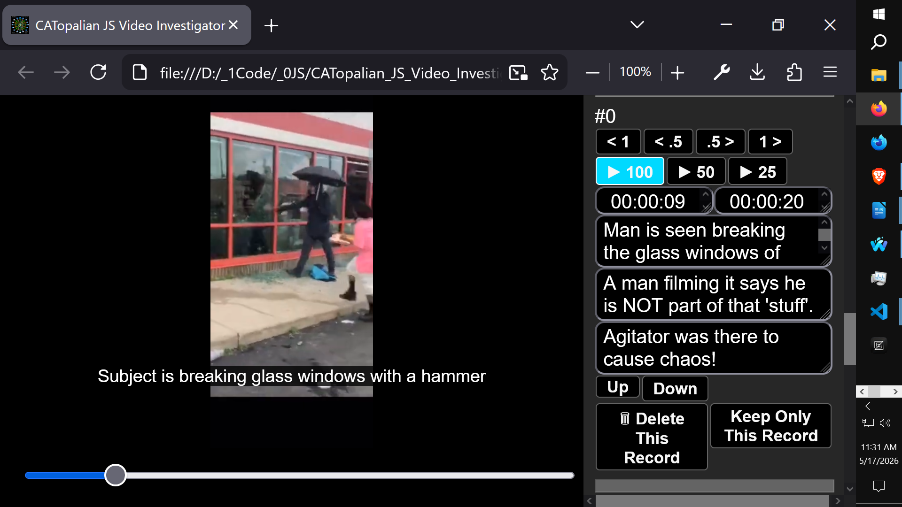

# CATopalian JS Video Investigator
**An air-gapped, zero-lag forensic video analysis and micro-expression tracking application.**

JS Video Investigator is a professional-grade, locally hosted web application designed for law enforcement, intelligence analysts, certified fraud examiners, and truth specialists. It provides millisecond-precision video scrubbing and robust data-logging without requiring external cloud servers or software installations, ensuring strict chain-of-custody for sensitive digital evidence.

## Target Audience
This tool is specifically engineered for:
* Forensic Video Analysts
* Law Enforcement Video Association (LEVA) Members
* Micro-Expression & Kinesic Interviewing Specialists
* Certified Fraud Examiners (CFE)
* OSINT Investigators & Defense Attorneys

## Core Features
* **Total Air-Gap Security:** Runs entirely in the browser using local File APIs. No data is ever uploaded to a server, ensuring 100% data privacy for classified depositions and interrogations.
* **Millisecond Precision Scrubber:** Custom-built timeline slider allows frame-by-frame isolation to catch fleeting micro-expressions.
* **Dynamic File Loading:** Hot-swap between multiple `.mp4`/`.webm` video files, `.js` investigation records, and `.vtt` caption tracks on the fly without refreshing the application.
* **A/B Loop Isolation:** Set precise Start and End markers to continuously loop specific events or behaviors for deep analysis.
* **Zero-Lag DOM Rendering:** Optimized UI architecture effortlessly handles hundreds of complex database entries without performance degradation.
* **Automated Reporting:** Instantly export detailed investigation logs, timecodes, and investigator notes directly to a new window or download them as a lightweight `.js` database file.

## Technical Specifications
Built using pure ES5/ES6 JavaScript, HTML5, and CSS3. 
* **Dependencies:** None. 
* **Server Requirements:** None (Runs locally via `file:///` protocol).

## Author & Licensing
**Created by Christopher Andrew Topalian**
*Proprietary software. Authorized enterprise, agency, and law enforcement site licenses are available upon request. For procurement or evaluation agreements, please contact the author directly.*

---

Useful for:
* Forensic Video Analysis
* LEVA (Law Enforcement Video Association)
* Micro-expression Analysis Tool
* Kinesic Interviewing
Certified Fraud Examiner (CFE)
OSINT Video Tools
Air-gapped Forensics

---

Use App: https://christopherandrewtopalian.github.io/CATopalian_JS_Video_Investigator/CATopalian_JS_Video_Investigator.html

Video: https://www.youtube.com/watch?v=3DWBWLSqu2I

---

### How to Download this App
1. **Click** the green **Code Button** on this github page
2. Choose **Download ZIP**
3. **Save** the **Zip File**
4. **Extract All**
5. **Double click** the **HTML file** to start the App

---

Happy Scripting :-)

---

// Dedicated to God the Father  
// All Rights Reserved Christopher Andrew Topalian Copyright 2020-2026  
// https://github.com/ChristopherTopalian  
// https://github.com/ChristopherAndrewTopalian  
// https://sites.google.com/view/CollegeOfScripting

